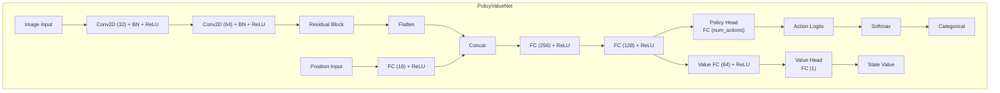
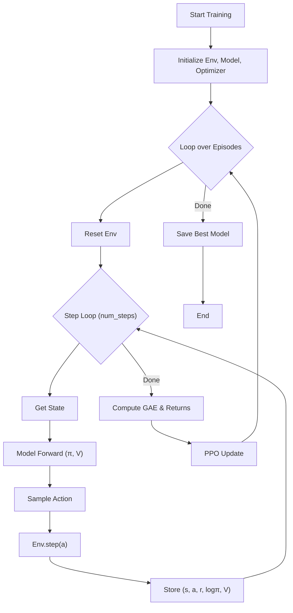
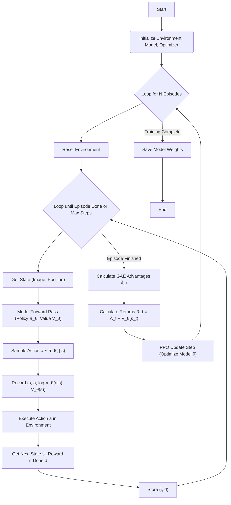
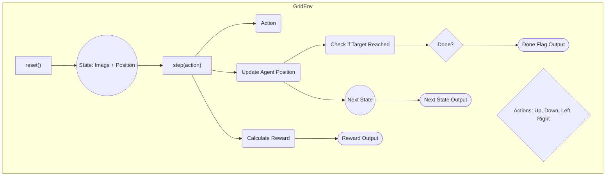
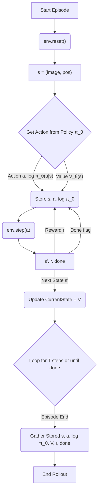
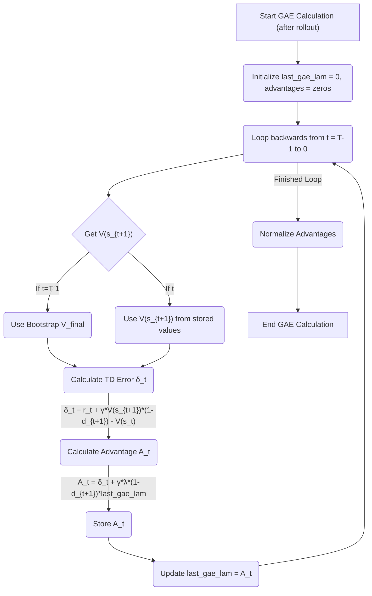
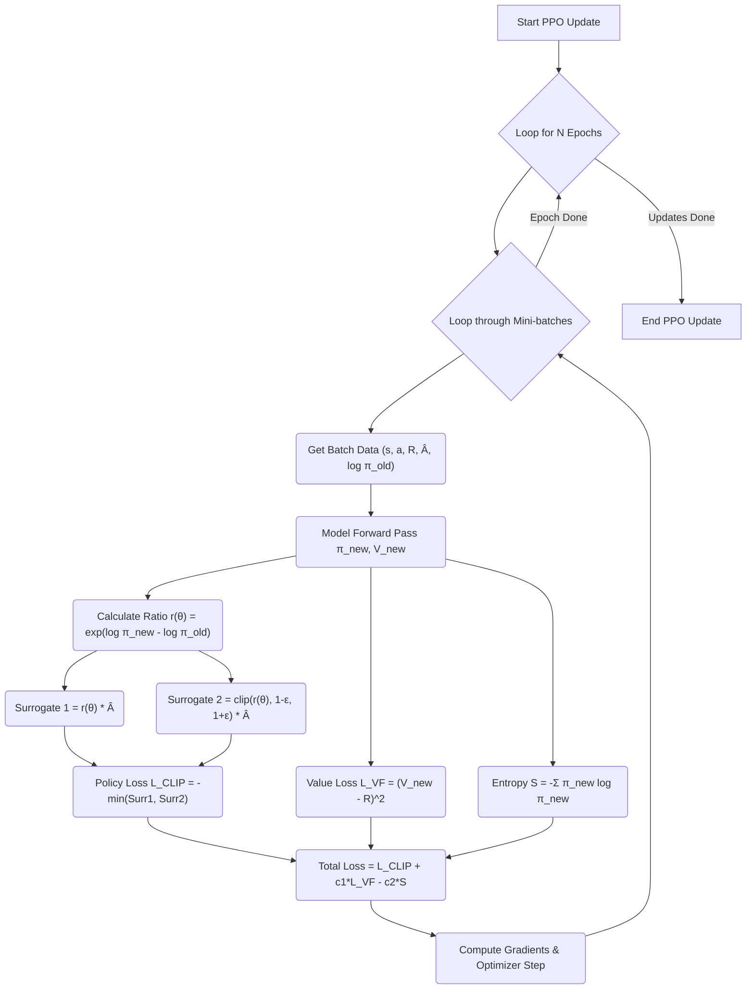

# PPO Agent for Grid World Navigation

This project implements a Proximal Policy Optimization (PPO) agent to solve a simple navigation task in a 2D grid world. The agent learns to navigate from a starting point to a target position while avoiding obstacles in a grid environment. The implementation uses deep reinforcement learning with an enhanced neural network architecture including convolutional layers, residual connections, and separate processing paths for spatial and positional data.

## Files

*   `train_ppo.py`: Contains the code for the PPO algorithm, the enhanced Actor-Critic neural network (`PolicyValueNet`), the `GridEnv` environment, and the main training loop. Running this script trains the agent and saves the model weights to `ppo_model.pth`.
*   `run_ppo.py`: Loads the pre-trained `ppo_model.pth` and runs the agent for one episode in the environment, visualizing the resulting trajectory in real-time with an anti-looping mechanism.
*   `maps/map1.txt`: Contains the map definition with start (S), target (T), walls (W), and empty spaces (E).
*   `requirements.txt`: Lists the necessary Python packages.
*   `ppo_model.pth`: (Generated by `train_ppo.py`) Stores the trained model weights with the best average reward during training.

## Setup

1.  **Clone the repository or download the files.**
2.  **Create a Python virtual environment (recommended):**
    ```bash
    python -m venv ppo_env
    source ppo_env/bin/activate  # On Windows use `ppo_env\Scripts\activate`
    ```
3.  **Install the required packages:**
    ```bash
    pip install -r requirements.txt
    ```

## Training the Agent

To train the PPO agent, run the `train_ppo.py` script:

```bash
python train_ppo.py
```

This will:
*   Initialize the environment and the `PolicyValueNet` model.
*   Run the training loop for a predefined number of episodes.
*   Collect trajectories, calculate advantages (using GAE), and update the model using the PPO clipped objective.
*   Print progress updates periodically.
*   Save the trained model's weights to `ppo_model.pth` upon completion.

## Running and Visualizing the Trained Agent

After training (which generates `ppo_model.pth`), you can visualize the agent's behavior by running `run_ppo.py`:

```bash
# Ensure your virtual environment is active
# (if you used the full path before, use that:) /path/to/ppo_env/bin/python run_ppo.py 
python run_ppo.py
```

This will:
*   Load the weights from `ppo_model.pth` into the `PolicyValueNet`.
*   Run the agent for one episode in the `GridEnv`.
*   Print the steps taken (position and action) during the episode.
*   Visualize the agent's path in real-time with an interactive plot.
*   Automatically detect and break out of loops with random actions when the agent gets stuck.
*   Display the total reward and steps taken after the episode completes.

## Mathematical Foundations and Implementation Details

### PPO Objective Function

The Proximal Policy Optimization (PPO) objective maximizes expected advantage while constraining policy updates for stability:

$$
L^{CLIP}(\theta) = \mathbb{E}_t \left[ \min\left(r_t(\theta) \hat{A}_t, \ \mathrm{clip}(r_t(\theta), 1-\epsilon, 1+\epsilon) \hat{A}_t\right) \right]
$$
where:
- $r_t(\theta) = \frac{\pi_\theta(a_t|s_t)}{\pi_{\theta_{old}}(a_t|s_t)}$
- $\hat{A}_t$ is the estimated advantage at time $t$
- $\epsilon$ is the clip parameter

**Value Loss:**
$$
L^V(\theta) = \mathbb{E}_t \left[ (V_\theta(s_t) - R_t)^2 \right]
$$

**Entropy Bonus:**
$$
S[\pi_\theta](s_t) = - \sum_a \pi_\theta(a|s_t) \log \pi_\theta(a|s_t)
$$

**Total Loss:**
$$
L(\theta) = L^{CLIP}(\theta) + c_1 L^V(\theta) - c_2 S[\pi_\theta](s_t)
$$

---

### Generalized Advantage Estimation (GAE) and TD Error

Generalized Advantage Estimation (GAE) is a method to compute a smoother, more robust estimate of the advantage function by blending many-step returns, controlled by a parameter $\lambda$.

#### Temporal Difference (TD) Error
The TD error measures how much better or worse the outcome was compared to the value function's prediction:
$$
\delta_t = r_t + \gamma V(s_{t+1}) - V(s_t)
$$
- $r_t$: reward at time $t$
- $V(s_{t+1})$: value estimate for next state
- $V(s_t)$: value estimate for current state
- $\gamma$: discount factor

#### GAE Advantage Calculation
GAE recursively combines TD errors to estimate the advantage:
$$
\hat{A}_t = \delta_t + (\gamma\lambda) \delta_{t+1} + (\gamma\lambda)^2 \delta_{t+2} + \ldots
$$
where $\lambda \in [0,1]$ controls the bias-variance tradeoff:
- $\lambda=0$: one-step TD (high bias, low variance)
- $\lambda=1$: Monte Carlo (low bias, high variance)

**Algorithm:**
1. Compute $\delta_t$ for each step in the trajectory.
2. Compute $\hat{A}_t$ backwards from the end of the episode:
   $$
   \hat{A}_t = \delta_t + \gamma\lambda (1-d_{t+1}) \hat{A}_{t+1}
   $$
   where $d_{t+1}$ is 1 if episode ended at $t+1$, else 0.

**Example:**
Suppose $\gamma=0.99$, $\lambda=0.95$, and the agent receives $r_0, r_1, r_2$ with value estimates $V(s_0), V(s_1), V(s_2), V(s_3)$. Then:
$$
\delta_0 = r_0 + \gamma V(s_1) - V(s_0) \\
\delta_1 = r_1 + \gamma V(s_2) - V(s_1) \\
\delta_2 = r_2 + \gamma V(s_3) - V(s_2)
$$
$$
\hat{A}_2 = \delta_2 \\
\hat{A}_1 = \delta_1 + \gamma\lambda \hat{A}_2 \\
\hat{A}_0 = \delta_0 + \gamma\lambda \hat{A}_1
$$

#### Value (TD) Loss in PPO
The value loss encourages the value network to match the observed returns:
$$
L^V(\theta) = \mathbb{E}_t \left[ (V_\theta(s_t) - R_t)^2 \right]
$$
where $R_t = \hat{A}_t + V(s_t)$ is the bootstrapped return.

This is implemented as mean squared error (MSE) between predicted and empirical returns, driving $V_\theta(s_t)$ to accurately predict the expected sum of discounted rewards.

---

---

### Reward Shaping

The reward at each step is:
$$
r_t = -0.1 + \mathbb{1}_{\text{hit wall/boundary}}(-1.0) + \mathbb{1}_{\text{target reached}}(10.0) + \begin{cases} +0.2 & \text{if closer to target} \\ -0.2 & \text{if farther from target} \end{cases}
$$

This encourages the agent to move efficiently toward the goal and avoid obstacles.

---

### Model Architecture (PolicyValueNet)



---

### Training Pipeline Overview



---


### Key PPO Components and Optimized Hyperparameters

| Component | Description | Optimal Value |
|-----------|-------------|---------------|
| **Learning Rate** | Step size for optimizer updates | 0.0001 |
| **Discount Factor (γ)** | Weight for future rewards | 0.995 |
| **GAE Lambda (λ)** | Controls bias-variance tradeoff in advantage estimation | 0.97 |
| **Entropy Coefficient** | Encourages exploration by rewarding higher entropy policies | 0.05 |
| **PPO Clip Range (ε)** | Limits policy update size for stability | 0.15 |
| **Value Loss Coefficient** | Scales the value function loss relative to policy loss | 0.75 |
| **PPO Epochs** | Number of optimization passes over each batch of experience | 6 |
| **Mini-batch Size** | Size of data chunks for optimization | 32 |
| **Adam Optimizer** | First-order gradient-based optimization | eps=1e-5 |

### Reward Structure (Summary)

- **Step Penalty**: -0.1 per step (efficiency)
- **Wall/Boundary Collision**: -1.0 (avoid illegal moves)
- **Target Reached**: +10.0 (goal)
- **Distance-Based Shaping**: +0.2 (closer), -0.2 (farther)

<!-- Anti-looping logic has been removed in the latest version for simplicity and efficiency. -->

### Best Model Tracking

During training, the model with the highest average reward (over a sliding window) is saved as `ppo_model.pth`. This ensures only the best-performing policy is preserved.

### Visual Diagrams & Mathematical Flow

#### 1. PPO Training Loop



#### 2. PolicyValueNet Architecture

```mermaid
graph TD
    subgraph PolicyValueNet
        InputImage["Image Input"] --> Conv1["Conv2D (32) + BatchNorm + ReLU"];
        Conv1 --> Conv2["Conv2D (64) + BatchNorm + ReLU"];
        
        Conv2 --> ResidualIn["Residual Block Input"];
        ResidualIn --> Conv3["Conv2D (64) + BatchNorm + ReLU"];
        ResidualIn -- "Skip Connection" --> ResidualAdd;
        Conv3 --> ResidualAdd;
        
        ResidualAdd --> Flatten["Flatten"];
        
        InputPosition["Position Input"] --> PosFC["FC (16) + ReLU"];
        
        Flatten --> Concat["Concatenate"];
        PosFC --> Concat;
        
        Concat --> FC1["FC (256) + ReLU"];
        FC1 --> FC2["FC (128) + ReLU"];
        
        FC2 --> PolicyHead["Policy Head\nFC (num_actions)"];
        FC2 --> ValueFC["Value FC (64) + ReLU"];
        ValueFC --> ValueHead["Value Head\nFC (1)"];
        
        PolicyHead --> ActionLogits["Action Logits"];
        ActionLogits --> ActionProbs["Action Probabilities (Softmax)"];
        ActionProbs --> ActionDist["Categorical Distribution"];
        ValueHead --> StateValue["State Value Estimate"];
    end
```



#### Network Architecture Details

- **CNN Backbone**:
  - First Conv Layer: 32 filters with 3×3 kernels, batch normalization, and ReLU activation
  - Second Conv Layer: 64 filters with 3×3 kernels, batch normalization, and ReLU activation
  - Residual Block: Third Conv Layer (64 filters) with a skip connection from the second layer

- **Position Processing**:
  - Dedicated fully connected layer (16 units) to process agent position information

- **Combined Processing**:
  - Concatenation of flattened CNN features and processed position data
  - Two fully connected layers (256 and 128 units) with ReLU activations

- **Dual Heads**:
  - Policy Head: Single FC layer outputting action logits (one per possible action)
  - Value Head: Two-layer network (64 hidden units) estimating the state value function

#### 3. Grid Environment Flow



#### 4. Trajectory Rollout (Data Collection)



#### 5. Generalized Advantage Estimation (GAE)



#### 6. PPO Update Step (Clipped Objective)



<!-- Visualization anti-looping logic is not present in the current version. -->
graph TD
    StartRun[Start run_ppo.py] --> LoadModel("Load Trained Model 'ppo_model.pth'");
    LoadModel --> InitEnv("Initialize GridEnv");
    InitEnv --> SetupVis("Setup Real-time Visualization");
    SetupVis --> ResetEnv("env.reset()");
    ResetEnv --> InitTrack("Initialize Position Tracking");
    InitTrack --> LoopSteps{"Loop for Max Steps or Until Done"};
    LoopSteps --> GetState("Get Current State s");
    GetState --> ModelInfer("Model Inference (No Grad)");
    ModelInfer --> CheckLoop{"Loop Detected?"};
    
    CheckLoop -- Yes --> RandomAction("Choose Random Action");
    CheckLoop -- No --> NormalAction("Sample Action from Policy");
    
    RandomAction --> UpdateTrack("Update Position History");
    NormalAction --> UpdateTrack;
    
    UpdateTrack --> StepEnv("env.step(a)");
    StepEnv --> RecordPos("Record Agent Position");
    StepEnv --> UpdateVis("Update Visualization");
    UpdateVis --> CheckDone{"Done?"};
    CheckDone -- No --> LoopSteps;
    CheckDone -- Yes --> PrintResults("Print Results & Show Final Path");
    PrintResults --> EndRun[End];
```

## Performance Results

With the optimized reward shaping, stable PPO updates, and best model tracking, the agent achieves:

- **Training Progress**: Consistent improvement over 2000 episodes
- **Final Average Reward**: >10 (over last 100 episodes)
- **Evaluation**: Agent reliably reaches the target in minimal steps
- **Success Rate**: Near 100% on standard maps

---

## Future Enhancements

Possible improvements to consider:

1. **Curriculum Learning**: Gradually increase environment complexity during training
2. **Multi-task Learning**: Train on multiple maps simultaneously for better generalization
3. **Curiosity-driven Exploration**: Add intrinsic motivation for more efficient exploration
4. **Parameter Tuning**: Further optimize hyperparameters using grid search or Bayesian optimization
5. **Attention Mechanisms**: Add attention layers to better focus on relevant parts of the observation
